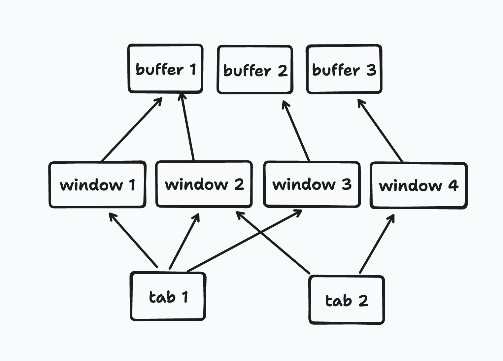

# GuruVim

一个开箱即用的 Neovim IDE 层，以难以置信的简单方式配置开发环境，例如配置 `golang`，只需：

```lua
require("guru").setup({
  golang = {
    enable = true,
    lsp = "gopls",
    linter = "golangci-lint",
    formatter = "gofmt",
    format_on_save = true,
  },
})
```

`:wq` 保存重启后，会自动安装语法高亮和 Golang Language Server，Linter，Formatter 等。

## 🛠 安装

### 注意事项

- 如缺少以下常见命令行工具，`git`、`wget`、`curl`、`ripgrep`、`nvim v0.9.x+`，则有可能安装失败。

  - 在 Mac 上，您可以使用 `brew install` 安装以上工具。
  - 在 Ubuntu 上，可以手动安装上述软件

- 如之前安装过其他配置，建议先删除或备份以下目录

```bash
rm -rf ~/.config/nvim
rm -rf ~/.cache/nvim
rm -rf ~/.local/share/nvim
```

### 安装步骤

1. 克隆本项目到 Neovim 配置目录

- 删除以下目录

```bash
rm -rf ~/.config/nvim
rm -rf ~/.cache/nvim
rm -rf ~/.local/share/nvim
```

- GitHub
  - use HTTPS

  ```bash
  git clone https://github.com/archiguru/GuruVim.git ~/.config/nvim
  ```

  - use SSH

  ```bash
  git clone git@github:archiguru/GuruVim.git ~/.config/nvim
  ```

- Gitee
  - use HTTPS

  ```bash
  git clone https://gitee.com/archiguru/GuruVim.git ~/.config/nvim
  ```

  - use SSH

  ```bash
  git clone git@gitee:archiguru/GuruVim.git ~/.config/nvim
  ```

2. 运行 `nvim` ，等待插件全部安装完成

3. 重启

## 自定义配置

自定义配置非常简单，就像配置一个插件一样，只需要修改 `~/.config/nvim/init.custom.lua` 后保存重启即可

```lua
require("guru").setup({
    -- 用户配置，按需设置参数

})
```

这里支持的参数非常的多，但基本上分为**常用配置**，和**编程环境配置**。

### 常用配置

例如用来设置主题的 `colorscheme` 这类常用的配置，修改后 `:wq` 保存重启即可生效

```lua
require("guru").setup({
    colorscheme = "gruvbox"
})
```

> GuruVim 默认使用 `gruvbox` 主题，同时内置了 `tokyonight`、`nord`、`onedark`、`gruvbox`、`nightfox`、`nordfox`、`duskfox`、`dracula` 主题。
> 可以通过 `:GuruColorPreview` 命令预览内置主题

<details>
<summary>Copilot 配置</summary>
  
```lua
require("guru").setup({
  cmp = {
    -- 启用 copilot
    copilot = true,
  },
})
```

GuruVim 内置了以下插件，启用后会使其生效

- [copilot.lua](https://github.com/zbirenbaum/copilot.lua)
- [copilot-cmp](https://github.com/zbirenbaum/copilot-cmp)

因为 copilot 是收费的，首次使用需要运行 `:Copilot auth` 认证后才会生效，但如果你是学生老师或者开源项目贡献者，可以[申请免费](https://docs.github.com/en/copilot/quickstart)使用。

> GitHub Copilot供经过验证的学生、教师和流行开源项目的维护者免费使用。

</details>

#### Buffers

在 Vim 世界里，Buffer 表示已经加载到内存中的文件。非常像 VSCode 中的 Tab 页，在 VSCode 里看到一个标签页，就表示一个文件加载到内存中了。

在 GuruVim 中使用 [bufferline.nvim](https://github.com/akinsho/bufferline.nvim) 插件来模拟这种行为，并且简化了配置，非常容易定制按键

<details>
<summary>Bufferline 配置</summary>
  
```lua
require("guru").setup({
  bufferLine = {
    enable = true,
    keys = {
      -- 左/右循环 buffer
      prev = "<C-h>",
      next = "<C-l>",
      -- 关闭当前 buffer
      close = "<C-w>",
      -- close = "<leader>bc",
      -- 关闭所有「左」 Tab
      close_left = "<leader>bh",
      -- 关闭所有「右」 Tab
      close_right = "<leader>bl",
      -- 关闭所有其他 Tab
      close_others = "<leader>bo",
      close_pick = "<leader>bp",
    },
  },
})
```

</details>

#### Super Windows

和 VSCode 不同，Vim 中的 Window 只是显示 Buffer 的窗口，允许多个窗口同时显示甚至修改一个 Buffer，在 GuruVim 中可以非常简单的定义一系列窗口相关的快捷键，包括水平垂直分割，快速窗口之间跳转，关闭等，称为 Super windows。

<details>
<summary>Super Windows 配置</summary>
  
```lua
require("guru").setup({
  s_windows = {
    enable = true,
    keys = {
      split_vertically = "sv",
      split_horizontally = "sh",
      -- 关闭当前窗口
      close = "sc",
      -- 关闭其他窗口
      close_others = "so",
      -- 在窗口之间跳转
      jump_left = { "<A-h>", "<leader>h" },
      jump_right = { "<A-l>", "<leader>l" },
      jump_up = { "<A-k>", "<leader>k" },
      jump_down = { "<A-j>", "<leader>j" },
      -- 控制窗口大小
      width_decrease = "s,",
      width_increase = "s.",
      height_decrease = "sj",
      height_increase = "sk",
      size_equal = "s=",
    },
  },
})
```

</details>

#### Super Tab

Vim 中的 Tab 是用来保存一个或多个 windows 组合，这样你就可以在不改变 windows 布局的情况下，切换到不同的 Tab， 用不同的 windows 布局来做不同的事。

在 GuruVim 中也可以快速的定义一组 tabs 相关的快捷键，称为 Super Tab

<details>
<summary>Super Tab 配置</summary>

注意 super tab 并不常用，所以默认是关闭的，需要手动启用

```lua
require("guru").setup({
  s_tab = {
    enable = true, -- 默认关闭
    keys = {
      split = "ts",
      prev = "th",
      next = "tl",
      first = "tj",
      last = "tk",
      close = "tc",
    },
  },
})
```

</details>

---

简单讲 Buffers & Windows & Tabs 三者的关系如下：

- buffer 是加载到内存的文件，我们用 bufferline 插件模拟类似 VSCode 的 Tab页 行为
- window 负责显示buffer，熟悉快速分割窗口，在不同窗口快速跳转的快捷键是提高开发效率的关键
- tab 负责组织 windows 布局，通常用不到，所以默认是关闭的



---

### 编程环境配置

例如 `Golang` 环境，设置 enable 后，`:wq` 保存重启会自动调用 Mason 安装对应的语法高亮 Language Server，Linter，Formatter 等。安装完毕后再次重启打开对应的 Golang 项目即可生效

```lua
require("guru").setup({
  colorscheme = "tokyonight"
  golang = {
    enable = true,
  },
})
```

开启其他语言相关的模块也都类似，修改 `~/.config/nvim/init.lua` 后保存重启，即可自动完成安装。

由于编程环境启用后需要额外安装LSP Linter Formatter 语法高亮等，所以默认情况下**编程环境配置**都是关闭的，需要手动开启，只有 `Lua` 是默认开启的，这是因为你会经常使用 `Lua` 语言来修改配置。而 **常用配置** 则大部分默认都是开启状态的。

> 完整默认参数列表在此 [config.lua](https://github.com/archiguru/GuruVim/blob/main/lua/guru/config.lua)

## 常用编程环境配置

语言环境相关模块请逐个打开，否则重启后一次会安装很多服务，需要等待较长时间。

<details>
<summary>Markdown 编辑</summary>
  
```lua
require("guru").setup({
  markdown = {
    enable = true,
    -- 以下为默认值，可以省略
    mkdnflow = {
      next_link = "gn",
      prev_link = "gp",
      next_heading = "gj",
      prev_heading = "gk",
      -- 进入链接
      follow_link = "gd",
      -- 从链接返回
      go_back = "<C-o>",
      toggle_item = "tt",
    },
    formatter = "prettier",
    -- 保存时格式化默认为false
    format_on_save = false,
    -- 文字长度到达边缘默认自动折行
    wrap = true,
    ---:MarkdownPreview 命令打开文章预览默认是 dark 皮肤
    ---@type "dark" | "light"
    theme = "dark",
  },
})
```

启用 markdown 功能后，重启会自动安装 Treesitter 的 markdown 语法高亮，和 prettier 用于格式化。

增加 `:MarkdownPreview` 命令实时预览 markdown 文件

增加 `mkdnflow.nvim` 相关的快捷键

增加 markdown 相关快捷键例如 `5x5table`

</details>

<details>
<summary>前端开发</summary>
  
前端开发配置相对比较复杂，因为需要安装多个 LSP，多种文件的语法高亮等，重启后需要等待时间会较长

```lua
require("guru").setup({
  frontend = {
    enable = true,
    -- 下边的都是默认值可以省略
    linter = "eslint_d",
    ---@type "eslint_d" | "prettier" | "tsserver"
    formatter = "tsserver",
    format_on_save = false,
    cspell = false,
    tailwindcss = true,
    prisma = false,
    -- Vue 将接管 typescript lsp
    vue = false,
    -- 由 typeescript.nvim 提供的额外 lsp 命令
    typescript = {
      keys = {
        ts_organize = "gs",
        ts_rename_file = "gR",
        ts_add_missing_import = "ga",
        ts_remove_unused = "gu",
        ts_fix_all = "gf",
        ts_goto_source = "gD",
      },
    },
  },
})
```

</details>

<details>
<summary>Golang开发</summary>
  
```lua
require("guru").setup({
  golang = {
    enable = true,
    -- 下边的都是默认值可以省略
    lsp = "gopls",
    linter = "golangci-lint",
    formatter = "gofmt",
    format_on_save = false,
  },
})
```
</details>

<details>
<summary>clangd开发</summary>
  
```lua
require("guru").setup({
  clangd = {
    enable = true,
    lsp = "clangd",
    -- linter = "clangd-tidy",
    formatter = "clang-format",
    format_on_save = false,
  },
})
```
</details>

<details>
<summary>Bash开发</summary>
  
```lua
require("guru").setup({
  bash = {
    enable = true,
    lsp = "bashls",
    --  brew install shfmt
    formatter = "shfmt",
    format_on_save = false,
  },
})
```
</details>

<details>
<summary>Python开发</summary>
  
```lua
require("guru").setup({
  python = {
    enable = true,
    -- can be pylsp or pyright
    lsp = "pylsp",
    -- pip install black
    -- asdf reshim python
    formatter = "black",
    format_on_save = false,
  },
})
```
</details>

<details>
<summary>Ruby开发</summary>
  
```lua
require("guru").setup({
  ruby = {
    enable = true,
    lsp = "ruby_ls",
    -- gem install rubocop
    formatter = "rubocop",
    format_on_save = false,
  },
})
```
</details>

<details>
<summary>Docker 开发</summary>
  
```lua
require("guru").setup({
  docker = {
    enable = true,
    lsp = "dockerls",
  },
})
```
</details>

## 日常使用

TODO

### 快捷键列表

## 项目结构

如何扩展

TODO

## Requirements

- Neovim v0.9.x.
- Nerd Fonts.

## License

MIT

WIP 🟡, PR is welcome.
